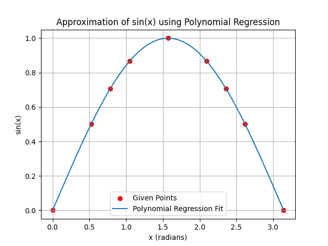

📐 Polynomial Sine Approximation using Machine Learning
Approximate the sine function (sin(x)) using Polynomial Regression with Python and Scikit-learn. This project visualizes curve fitting for sine waves and allows users to input angles in degrees to see how well the model predicts sine values.

🚀 Project Overview
This project demonstrates:

Training a Polynomial Regression Model (degree = 5) to approximate sin(x).

Visualizing the polynomial curve fitting to sample sine data points between 0° and 180°.

Allowing user interaction via console inputs to predict sine values using the trained model.

Comparing predicted sine values with actual sine values dynamically.

📊 Sample Output Graph

🧰 Tech Stack
Python 3.x

NumPy

Matplotlib

Scikit-learn (PolynomialFeatures & LinearRegression)

✨ Features
✅ Polynomial Regression for curve fitting
✅ Visualization of approximation accuracy
✅ User inputs angle (0° to 180°) & gets predicted sine value
✅ Comparison between predicted and actual sine values

🗂 Folder Structure
bash
Copy
Edit
Polynomial-Sine-Approximation/
│
├── Figure_1.png                    # Sample Output Graph
├── sin_polynomial_regression.py    # Main Python Script
└── README.md                       # Project Documentation
🖥️ How to Run
Clone this repository.

Install dependencies:

bash
Copy
Edit
pip install numpy matplotlib scikit-learn
Run the Python script:

bash
Copy
Edit
python sin_polynomial_regression.py
The program will display the fitted graph and prompt you to enter 5 custom angles (in degrees) to see the predicted sine values.

🎯 Example Use Case
css
Copy
Edit
Attempt 1/5 - Enter a value of x (in degrees, between 0 and 180): 60
Predicted sin(60°) ≈ 0.86603
Actual sin(60°) = 0.86603
💡 Learning Objectives
Polynomial Regression understanding

Feature transformation using Scikit-learn

Curve fitting & data visualization with matplotlib

Handling real-time user inputs for ML model inference

